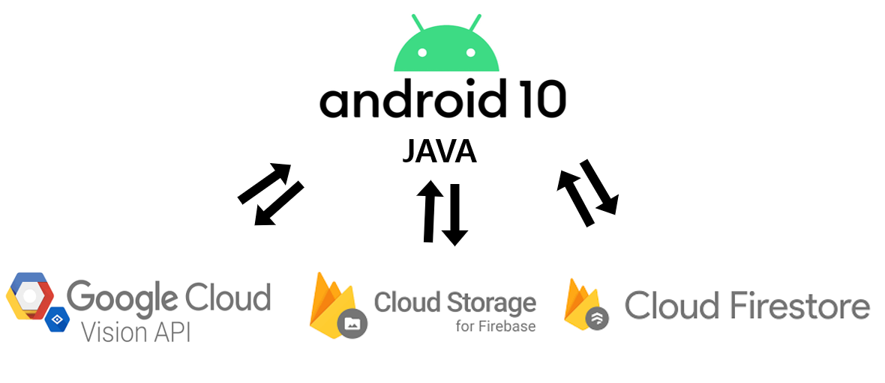

# MY TIP

1. [프로젝트 설명](#프로젝트_설명)
2. [시스템구성도](#시스템구성도)
3. [시연영상](#시연영상)
4. [개발환경](#개발환경)
5. [API](#API)
6. [전제사항](#전제사항)
7. [LICENSE](#LICENSE)

## 프로젝트_설명
 *MY TIP은 티켓 사진을 이용하여 구글 클라우드 비전 API으로 티켓의 문자를 인식하고 그 인식 결과를 가지고 편하게 후기를 쓸 수 있는 앱 입니다.
 *내 손 안에서 편하게 티켓과 후기를 관리하자는 생각에서 만들었습니다. 

## 시스템구성도

## 시연영상
[시연영상](https://youtu.be/OYZ4l7Rcspk)

## 개발환경
 *개발 환경 - Android Studio 4.0.1, Gradle Version 6.1.1
 *개발 언어 - Android Studio (Java)

## API
[Google Cloud VISION](https://cloud.google.com/vision/?hl=ko&utm_source=google&utm_medium=cpc&utm_campaign=japac-KR-all-ko-dr-bkws-all-super-trial-e-dr-1009137&utm_content=text-ad-none-none-DEV_c-CRE_263264133482-ADGP_Hybrid%20%7C%20AW%20SEM%20%7C%20BKWS%20~%20T1%20%7C%20EXA%20%7C%20ML%20%7C%201%3A1%20%7C%20KR%20%7C%20ko%20%7C%20Vision%20%7C%20google%20cloud%20vision-KWID_43700031880239430-kwd-433713029900&userloc_1030738-network_g&utm_term=KW_%EA%B5%AC%EA%B8%80%ED%81%B4%EB%9D%BC%EC%9A%B0%EB%93%9C%EB%B9%84%EC%A0%84&gclid=Cj0KCQiA2af-BRDzARIsAIVQUOfxGwUQXmoBND8Hqr_Zcni3dbh7bNnvJISXSkDgk_3iQ-cw5lYmhvwaAhd8EALw_wcB)
[Firebase](https://firebase.google.com/?hl=ko) 

## 전제사항
 *본 프로젝트의 범위는 스마트폰만 해당된다. 갤럭시탭이나 아이패드와 같은 다른 디바이스는 고려하지 않는다.
 *본 프로젝트는 안드로이드 버전 10에서만 실행가능하다.

## LICENSE
Copyright 2016 Google Inc. All Rights Reserved.

 Licensed under the Apache License, Version 2.0 (the "License");
 you may not use this file except in compliance with the License.
 You may obtain a copy of the License at

 http://www.apache.org/licenses/LICENSE-2.0

 Unless required by applicable law or agreed to in writing, software
 distributed under the License is distributed on an "AS IS" BASIS,
 WITHOUT WARRANTIES OR CONDITIONS OF ANY KIND, either express or implied.
 See the License for the specific language governing permissions and
 limitations under the License.

